# 评论模拟器 (comment-mock)

模拟 B 站、微博、知乎和通用博客的评论区，制作视频贴纸、文章配图和演示截图。支持直接编辑、复用角色与模板，把整段讨论或选中的几条评论导出成图片。

**单文件 HTML，无后端，无构建；下载后可离线出图。** 把完整的 `index.html` 拖进浏览器即可使用，不需要注册账号或预先缓存截图组件。

[下载完整仓库](https://github.com/fisHarly0/comment-mock/archive/refs/heads/main.zip) · [小白教程](TUTORIAL.md) · [使用说明](#使用说明)

1. **写评论**：添加评论，直接点击昵称、正文或点赞数字修改；也可插入示例、批量粘贴或使用模板。
2. **选画面**：导出整段、单条或多条组合，选择透明贴纸或背景合成，再设置比例和宽度。
3. **拿图片**：点「预览图片」检查实际 PNG，再复制图片或保存文件；用「导出 JSON」备份可继续编辑的素材。

字母头像和本地上传图片可离线使用，外站图片网址仍需网络。也可部署到静态托管；本仓库目前不提供已验证的在线演示地址。

---

## 功能特性

- **4 套主题** -- B 站、微博、知乎、通用博客，一键切换，自动套用各家的配色、间距、tag 样式、IP 属地文案
- **评论 / 回复** -- 添加 / 编辑 / 删除，支持嵌套回复，点赞 / 踩按钮带状态
- **身份标签** -- UP 主、大会员、LV1-6 等级徽章
- **随机生成** -- 一键随机昵称、IP 属地、字母头像（首字带圆形纯色底）；也支持自定义头像 URL 和本地上传
- **自定义样式面板** -- 实时调整背景色 / 渐变 / 背景图、评论板圆角 / 阴影 / 毛玻璃、字号、头像大小、显示开关（隐藏头像/标签/时间/IP 等等），所有值存 localStorage
- **点击预览编辑** -- 直接点击昵称、正文或点赞数字；Enter 保存，Shift + Enter 换行，Esc 取消
- **长讨论查找** -- 按昵称或正文查找主评论和回复，循环定位、直接编辑命中项；查找标记不进入图片
- **快速起稿** -- 内置视频互动、产品建议、知识问答示例；支持从文本或表格批量粘贴评论与回复
- **可恢复编排** -- 评论撤销 / 重做、复制和上下调序；按赞数排序预览，PNG 跟随当前展示顺序
- **角色与模板** -- 保存昵称、头像与身份；把整段评论、平台风格、自定义样式和导出构图一起存成模板
- **素材库管理** -- 搜索角色昵称、模板名称或评论内容，行内改名；模板可替换当前讨论，也可只追加评论
- **PNG 图片导出** -- 整段、单条或多条评论组合；透明贴纸、长图、1:1 方图、9:16 竖图、16:9 横图；指定输出宽度，自动移除编辑按钮
- **离线出图** -- 截图组件随 HTML 内置，下载完整文件后首次断网打开也能生成 PNG，无需安装依赖
- **生成后预览** -- 用实际 PNG 检查尺寸、透明区域和文字；支持深浅检查底色、原尺寸滚动，可复制图片或保存预览快照
- **背景画面合成** -- 上传视频截图或用纯色背景，设置填充方式、评论位置、宽度和留白；构图随导出设置、模板及JSON复用
- **手机快捷操作** -- 底部入口在评论、工具和生成预览之间切换，减少长页面滚动
- **图片与保存恢复** -- 上传图片自动缩小、保留透明；存储失败持续提示、可备份和重试；损坏的旧数据不会被自动覆盖
- **多页面冲突提醒** -- 检测其他页面修改，保留本页内容并暂停冲突项保存，可先备份再选择恢复版本
- **重复素材省空间** -- 评论和素材库分别对相同本地图片去重，复用头像、模板时减少浏览器保存占用；不降低图片质量
- **完整 JSON 备份** -- 包含评论、主题、样式、角色、模板和导出设置；相同本地图片只保存一份，兼容旧版 JSON，校验通过并确认后才替换内容

## 截图预览

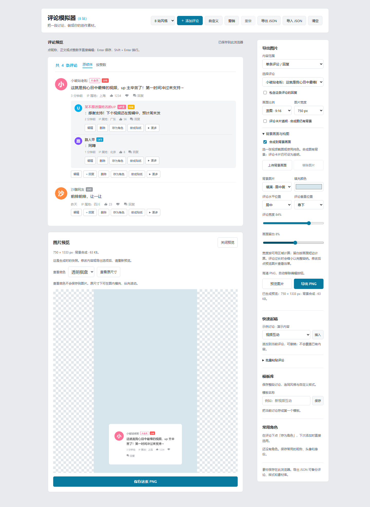

| B 站 | 微博 |
|---|---|
| 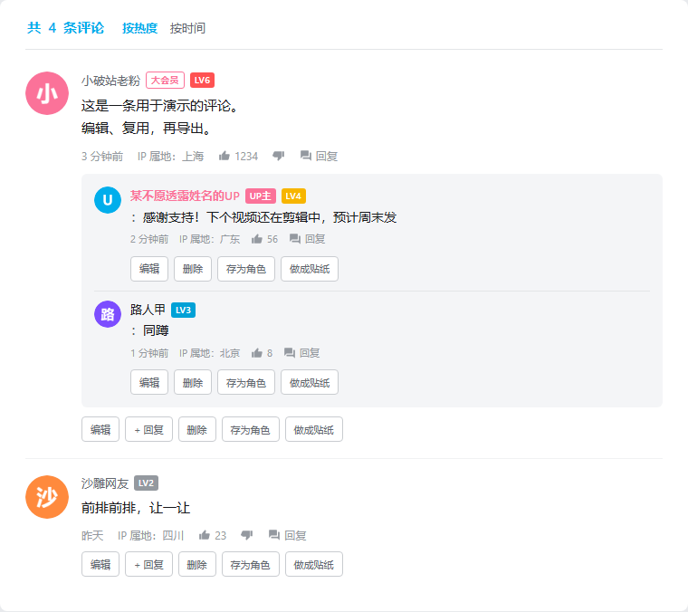 | 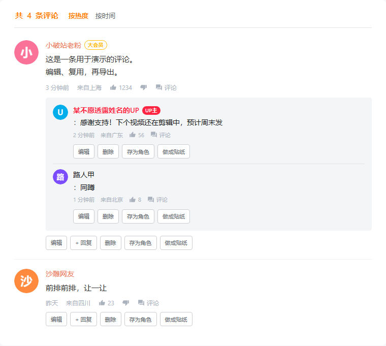 |

| 知乎 | 博客 |
|---|---|
| 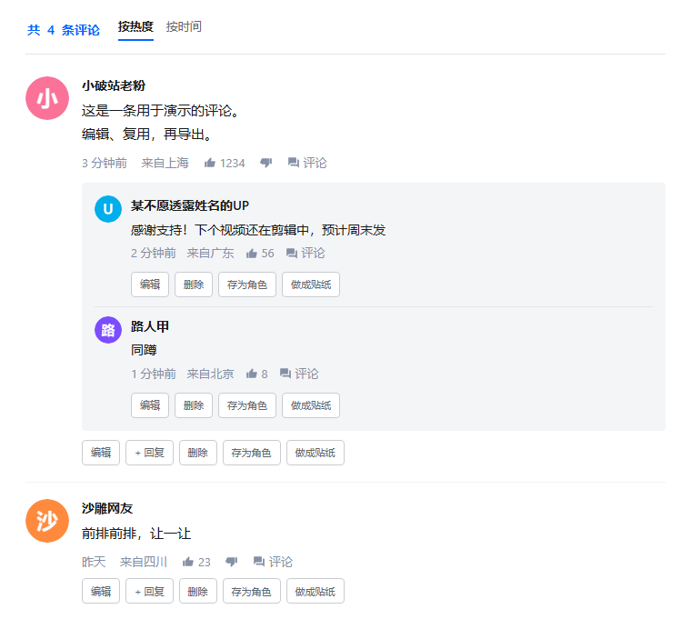 | 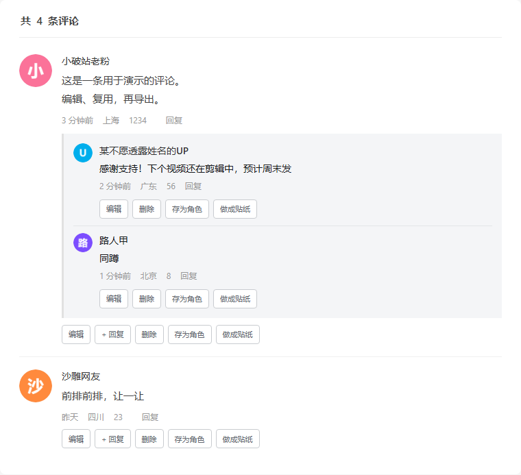 |

以上均为应用实际渲染截图，评论为演示内容。

## 技术栈

| 项 | 说明 |
|---|---|
| 语言 | 原生 HTML + CSS + JavaScript（ES6+） |
| 框架 | 无（纯原生 DOM 操作） |
| 截图组件 | [html2canvas](https://html2canvas.hertzen.com/) 1.4.1（随 HTML 内置，仅用于 PNG 截图，无运行时 CDN 依赖） |
| 数据持久化 | localStorage（浏览器本地存储） |
| 构建工具 | 无（零构建、零配置） |

## 快速开始

### 方式一：本地直接打开

1. [下载仓库 ZIP](https://github.com/fisHarly0/comment-mock/archive/refs/heads/main.zip) 后解压，或克隆本仓库
2. 双击 `index.html`，或右键选择「用浏览器打开」
3. 开始使用

```bash
# 克隆仓库
git clone https://github.com/fisHarly0/comment-mock.git
cd comment-mock
# 直接用浏览器打开
start index.html
```

### 方式二：部署到 GitHub Pages

1. Fork 本仓库（或用自己的仓库）
2. 进入仓库 Settings -> Pages
3. Source 选择 `main` 分支，目录选 `/ (root)`
4. 点 Save，等待几分钟后访问 `https://<你的用户名>.github.io/comment-mock/`

### 方式三：部署到其他静态托管

把 `index.html` 上传到 Vercel / Netlify / 自建 nginx 等任意静态托管即可。无需任何构建步骤。

## 项目结构

```
comment-mock/
├── index.html       # 单文件应用，含样式、业务代码和截图组件
├── README.md        # 功能与使用说明
├── TUTORIAL.md      # 小白教程
├── LICENSE          # 项目许可证
├── docs/screenshots/ # 实际界面截图
├── docs/decisions/  # 实现决定与验证记录
├── memory/          # 开发状态与交接记录
└── spec/            # 模块规格索引
```

运行应用只需完整的 `index.html`。CSS、业务 JS 和 html2canvas 均已内嵌，不需要额外文件或浏览器缓存即可本地离线出图。在线网址首次打开仍需联网下载网页；本项目不提供离线网站缓存。

### index.html 内部结构

| 区域 | 说明 |
|---|---|
| CSS 样式 | 4 套主题、自定义覆盖层、创作面板、窄屏布局 |
| HTML 结构 | 工具栏、评论预览、导出与素材库、自定义抽屉、评论表单 |
| 内置截图组件 | `vendor-html2canvas` 脚本块，保留上游原文与完整 MIT 许可 |
| 业务 JS | 评论状态、直接编辑、主题、素材库、PNG 导出、JSON 备份 |

## 使用说明

### 基本操作

1. 浏览器打开 `index.html`
2. 顶部下拉选风格（B 站 / 微博 / 知乎 / 博客）
3. 点 **添加评论** 填写昵称、内容等信息，点保存
4. 点击预览中的昵称、正文或点赞数字直接编辑，或使用评论下的 **编辑 / 回复 / 删除**
5. 在导出面板选择范围、比例和宽度，点 **导出 PNG**

### 视频贴纸与尺寸

- 点评论下的 **做成贴纸**，自动选择该评论并开启透明背景；再点 **导出 PNG**。
- 可单独选一条回复，或勾选 **包含这条评论的回复**。
- 图片宽度支持 750 / 1080 / 1440 px 和自定义 320–2160 px；这是文件实际像素宽度。
- 方图、竖图和横图会完整容纳内容，必要时缩小，不裁掉评论；长讨论建议选长图。
- 透明模式去掉评论板及回复区背景，保留文字、头像和身份标签，可叠加到视频画面。

### 检查最终图片

- 点 **预览图片** 生成实际 PNG，在评论区下方查看尺寸、文件大小与渲染效果。生成预览不会自动下载。
- 切换透明棋盘、浅色或深色底检查透明图；这些底色不写进 PNG。点 **查看原尺寸** 可在图内滚动检查细节。
- 点 **保存这张 PNG** 下载当前显示的快照。修改评论、样式或导出选项后，需重新点 **预览图片**；原来的快照会保留到替换或关闭。
- 点 **复制图片** 后，可粘贴到支持图片的应用。复制与下载使用同一张预览PNG，保留尺寸和透明区域；查看底色不会进入图片。浏览器不支持或拒绝剪贴板写入时，会提示改用 **保存这张 PNG**。
- 生成图片使用点击时的评论、主题和自定义样式；等待期间仍可继续编辑，新修改会在下一次生成时生效。
- 复制只在点击时发生，不会读取你的剪贴板。等待复制期间关闭或替换预览，已经提交的仍是点击时那张图片；新预览需要重新复制。
- 长讨论中的点赞和正文修改会局部更新预览；未修改的讨论保留，查找、排序、撤销及导出内容照常同步。

- **导出 PNG** 始终根据当前内容与选项生成新图片，仍可直接使用。
- 手机/窄屏底部的 **评论 / 工具 / 预览图片** 提供快捷跳转和生成入口；预览仅在当前页面保留，不进入 JSON 备份。

键盘也能连续操作评论：点赞、踩和保存编辑框后，焦点留在对应控件；调序保留「更多」菜单，移到边界时回到菜单标题。删除后焦点移到相邻评论正文，删空后回到预览标题。行内编辑按 **Tab / Shift + Tab** 保存并前进 / 后退；输入无效时会保留在输入框，按 **Esc** 可放弃修改。

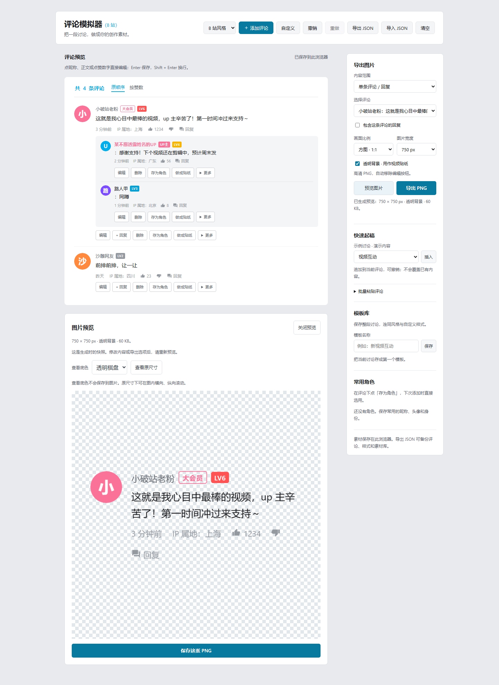

### 把评论放进背景画面

1. 展开 **背景画面与构图**，勾选 **合成到背景画面**。
2. 上传本地视频截图，或直接选择填充颜色。图片最长边自动缩至1920 px；原图不上传到服务器。
3. 选择背景填满裁切或完整显示，以及评论水平/垂直位置、宽度、留白。宽度按扣除留白后的可用区域计算；留白以画面短边为基准。
4. 点 **预览图片** 查看整张合成画面，再保存PNG。评论过长会缩小，始终完整容纳。

合成开启时，自动比例使用背景图片比例；无图则为9:16，也可指定方图、横图或竖图。合成图始终有不透明底色，「评论卡片透明」只去掉评论底色。要输出透明贴纸，取消合成，或直接点评论下的「做成贴纸」。

范围、目标、尺寸与构图会尝试自动保存，模板和JSON也包含它们。导入不含导出设置的旧文件时，组合选择清空，其余导出设置保留；单条导出目标在评论删除后回退首条。生成中的画面使用点击生成时的导出设置，后续修改需重新预览。

### 角色与模板

- 评论下点 **存为角色**，或在编辑表单中保存角色。应用角色保留正在填写的正文、时间和点赞数。
- 模板库输入名称，点 **保存**。载入模板前会确认替换当前评论、样式及模板中保存的导出设置。
- 在「查找模板」输入名称、昵称或评论/回复片段；「查找角色」按昵称匹配。搜索忽略英文大小写，结果旁显示命中数；清空搜索可回到完整列表。
- 点 **改名** 后直接输入新名字，Enter保存，Esc或「取消」放弃。名称最多40字，不允许空白或与库内其他素材重名；角色改名不更改已插入评论，也不替换头像。
- 模板下的 **替换** 会确认后恢复完整模板；**追加** 只加入评论及回复，保留当前风格、样式和构图，可用一次撤销移除整批。超出500主评论/1000总评论时整批拒绝。
- 最多保存 50 个角色、20 个模板；本地存储不足时会提示保存失败。
- 保存失败的角色/模板仍留在当前页面，JSON备份包含这些内容；离开前请先备份或重试成功。
- JSON 备份含素材库；仅导入旧版评论文件时保留当前素材库。

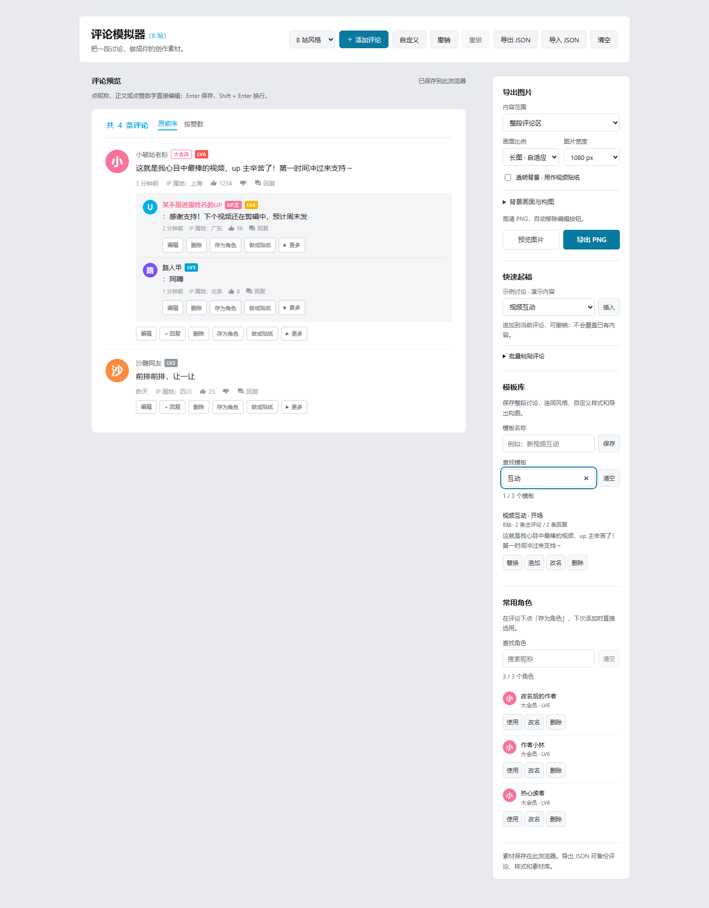

### 批量起稿与撤销

「快速起稿」的示例均为演示内容，插入时追加到当前讨论。批量粘贴每行使用 `昵称 | 正文 | 点赞数`，也接受从表格复制的三列（制表符分隔）。仅填正文会自动生成昵称；以 `>` 开头的行回复上一条主评论。例如：

```text
小雨 | 收藏了，周末试试 | 12
> 作者 | 欢迎分享你的作品 | 3
阿树 | 配色很好看 | 8
```

粘贴后先显示识别结果，全部行合法才可一次添加。一次最多 100 行；主评论最多 500 条、含回复合计最多 1000 条。

评论下的「更多」可以复制或调序。「按赞数」只改变展示及 PNG 顺序，不改变 JSON 中的原顺序；手动调序需切回「原顺序」。

撤销 / 重做针对评论内容与顺序，支持批量插入、复制、删除、清空、导入和模板替换；**不撤销主题、样式、素材库或导出设置操作**。支持 Ctrl / ⌘ + Z、Ctrl / ⌘ + Shift + Z（输入框内保留原生文字撤销）。历史在本次页面会话中保留，最多 30 步；图片较大时会更早移除旧历史。刷新后历史清空，已保存的评论仍保留。

### 自定义样式

点 **自定义** 按钮打开设置面板，可以调整：

- **背景板**：颜色、渐变、背景图、缩放方式
- **评论板**：底色、圆角、内边距、阴影、边框、毛玻璃
- **文字颜色**：主色、正文、昵称、副文字
- **尺寸**：整体宽度、头像大小、正文字号
- **显示开关**：隐藏/显示头像、身份标签、时间、IP 属地、点赞按钮等
- **文本替换**：自定义页面标题、评论数前缀/后缀

自定义设置会尝试自动保存到浏览器 localStorage；显示未保存提醒时仅在当前页面保留，离开前请先备份或重试保存成功。

### 查找长讨论里的评论

展开预览上方的 **查找评论**，输入昵称或正文片段。查找忽略大小写和首尾空格，包含回复；同一条评论重复出现关键词只计一次。特殊符号按原文匹配。

- **Enter / 下一条** 定位下一个命中项；**Shift + Enter / 上一条** 反向定位，到末尾后循环。
- **编辑此条** 直接编辑当前命中项的正文；查找结果按当前预览顺序排列。
- **Esc** 清空关键词，再按一次收起；也可点清空或查找栏标题。查找栏打开时随评论区域滚动保持可用。

编辑、删除、撤销或排序后会更新结果；当前项仍存在且匹配时保持定位，否则取消选择。查找不会过滤预览、改变导出范围或写入撤销记录。点标题收起时保留本次会话的关键词，再打开可继续查找；刷新后清空。输入中的无效评论需先修正或取消，再跳转。

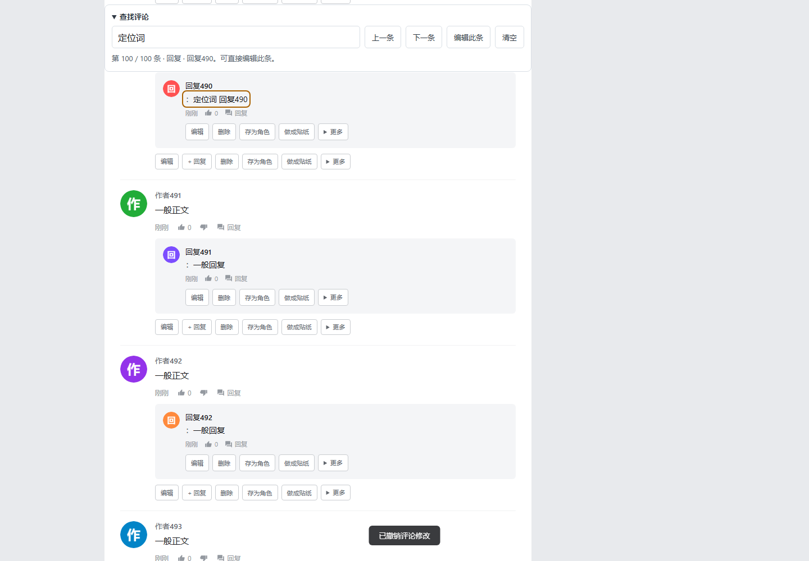

### 多条评论合成一张图

将导出图片的 **内容范围** 改成 **多条评论组合**。可以在侧栏按昵称或正文查找并勾选，也可直接在评论操作区勾选 **选入图片**。**选中当前结果** 只加入当前筛选显示的条目；换关键词不会取消先前选择，**清空选择** 会清除全部勾选。

「已选」统计亲自勾选的条目，「组合共」统计图片里实际包含的条目；开启全部回复后，组合条数可能大于已选条数。

- 同时选择主评论及其回复时保留层级；开启 **包含已选主评论的全部回复** 会把该主评论下未勾选的回复也加入图片，同一条回复不会重复出现。
- 只选择某条回复时，它按独立评论显示。组合顺序跟随当前预览，计数显示实际导出的评论和回复总数。
- 可以继续使用透明、尺寸、画面比例和背景构图；先点预览图片检查，选择控件不会出现在PNG中。

选择会随导出设置保存，也进入模板和JSON。编辑、排序或移动保留原对象；删除会移除失效选择，撤销删除不会自动重新勾选。仅含评论而没有导出设置的旧文件会清空选择，避免选到替换后的其他评论。没有选择时不能生成新图，已有图片预览仍可保存。

开始生成后，当前组合内容与导出设置固定；之后改变勾选需要重新生成。组合模式需要本版编辑器读取；如需切回较旧HTML，先改为整段或单条模式。

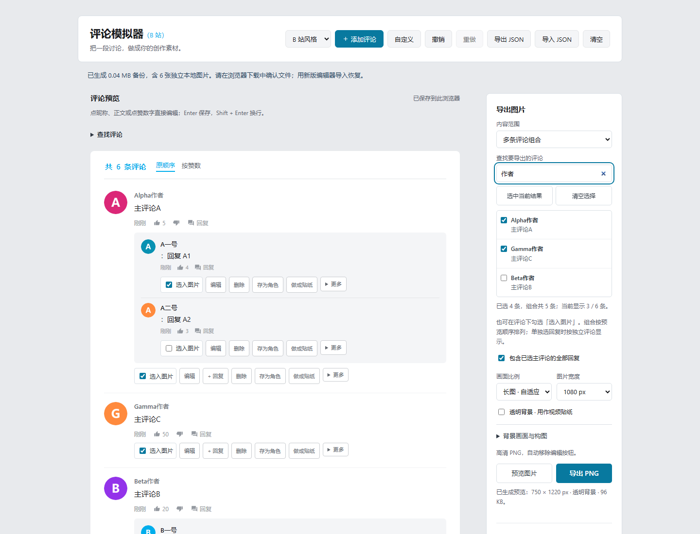

### 数据管理

- **导出 JSON**：将已确认的评论、样式、角色、模板及导出设置保存为文件，同一张本地图片只保存一份
- **导入 JSON**：校验文件及图片引用、显示内容数量，确认后恢复；取消或校验失败保留当前内容
- **清空**：删除所有评论（需确认）

新版导出采用 v3 去重格式，需要用新版编辑器恢复。旧版仅含 `comments` 的文件及 v1/v2 备份仍可导入；缺少的风格、样式和素材库保留当前值。缺少导出设置时，组合选择清空，其余导出设置保留。旧版编辑器无法读取 v3 文件，请将新版 HTML 与重要备份一起保留。

文件上限64 MB，图片按每次引用展开后的保守预算上限256 MB（均按1024进制计算）。导出也检查同样限制，不生成已知超出回导范围的文件。超限时保留本页并提示减少或拆分素材；尚未提交的输入、撤销历史和预览PNG不进入备份。备份和浏览器保存都会减少重复图片占用，但不会提高浏览器本身的容量上限。

导出后查看页面顶部的文件大小提示，并在浏览器下载列表确认文件已经保存。恢复后若提示部分内容未保存，当前页仍能使用这些内容；请保留原备份，减少素材后再重试保存。

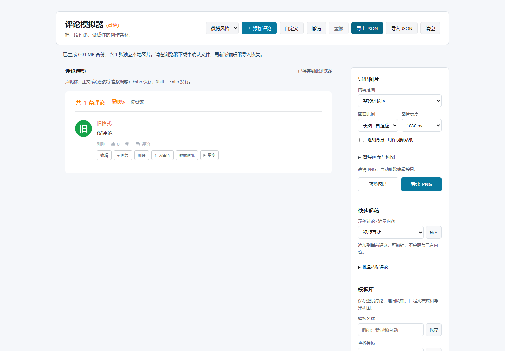

## 数据存储

所有数据存浏览器 localStorage，不会上传任何服务器。

| Key | 内容 |
|---|---|
| `comment-mock-v1` | 评论列表 |
| `comment-mock-theme` | 当前主题 |
| `comment-mock-style` | 自定义样式（颜色、显示开关、文本） |
| `comment-mock-library-v1` | 常用角色、评论模板 |
| `comment-mock-export-v1` | 导出范围、目标、尺寸和背景构图 |

评论和素材库各自在自己的存储项内对相同本地图片去重，不降低图片质量；跨存储项不共享图片。只有去重后更小时才使用新格式。旧数据打开时保持原样，下次保存时自动采用更小格式；图片多且各不相同，仍可能保存失败。

完整JSON备份会检查所有部分合并后的展开预算；即使各部分可以单独保存，合并备份仍可能超限，需要减少或拆分素材。

**请保留新版 HTML 和 JSON 备份。** 新的本地去重格式不能由旧编辑器直接读取；回退前先用新版导出JSON，再交给支持v3备份的旧编辑器导入。此前带损坏数据保护的版本会保留无法读取的原值；不要在旧版中确认用默认内容覆盖。更早版本未经兼容验证。

> **注意**：清空浏览器数据会丢失所有内容。重要素材建议用「导出 JSON」备份。

## 浏览器兼容性

当前自动化验证使用 Chromium headless，覆盖本地文件与本地 HTTP、桌面和窄屏布局，以及真实 PNG / JSON 下载。离线版本验证了无缓存、启动前断网的本地文件出图。

Firefox、Safari 和真实手机系统尚未完成验证，不承诺具体最低版本。不支持 IE。复制图片还取决于浏览器剪贴板能力和权限；无法复制时仍可保存 PNG。

## 常见问题

### Q: 截图时外站头像丢失或变成字母头像？

外部图片可能因断网、超时或跨域限制无法读取。生成前检测到加载失败时，会使用字母头像替代并在结果中提示；跨域图片仍可能无法正常截图。建议：

- 使用「随机头像」功能（生成字母头像，不依赖外部图片）
- 使用「上传」功能上传本地图片作为头像

### Q: 数据丢失了？

所有数据存在浏览器 localStorage 中。以下情况会丢失数据：
- 清除了浏览器缓存/数据
- 使用了隐私/无痕模式
- 换了浏览器或设备

建议定期使用「导出 JSON」功能备份。

### Q: 截图不清晰？

选择更大的输出宽度。固定比例下，过长的评论会缩小以完整容纳；可改成长图或单条导出。

### Q: 如何在截图中隐藏编辑按钮？

导出 PNG 时会自动隐藏编辑相关按钮，无需手动操作。

### Q: localStorage 容量不够？

页面会持续提示哪些部分未保存。先点 **备份当前 JSON**，减少不用的图片、角色或模板，再点 **重试保存**。未经保存的内容仅在当前页面保留；刷新可能丢失。若已使用新版保存，重复导入同一备份不会进一步减少占用。

上传支持 PNG / JPEG / WebP / GIF，单张最多20 MB、5000万像素；头像最长边缩至256 px，背景最长边缩至1920 px，不放大小图。浏览器内优先编码为WebP（不支持时回退PNG），保留透明，动画转为静态帧。已有图片和远程头像不会自动压缩。

若提示旧数据损坏，应用会使用对应部分的默认内容并保护原始值。先点 **下载损坏的原始数据** 留存排查文件（不是可直接导入的评论备份），再决定是否重试保存；覆盖损坏值前会要求确认。

### Q: 多个页面同时打开，出现保存冲突？

当另一个页面更改或清除了保存内容，顶部会列出有冲突的部分。本页内容保留，冲突项暂停自动保存；普通 **重试保存** 不会覆盖另一个版本。

先点 **备份当前 JSON**，再选择：

- **载入已保存版本**：确认后刷新整页，读取浏览器中的版本；本页尚未保存的内容、表单草稿和撤销记录会丢弃。
- **以本页覆盖冲突项**：确认用本页内容替换冲突项。建议两个页面先分别导出备份；确认期间再次变化的部分仍会保留提醒。

两个页面的修改不会自动合并。JSON 保存已确认的评论和设置，不包含尚未提交的表单或行内输入；先完成编辑再备份。浏览器存储不提供跨页面原子事务，极短的同时写入仍可能出现后写覆盖，所以请尽量在一个页面编辑。此功能也不提供跨设备同步。

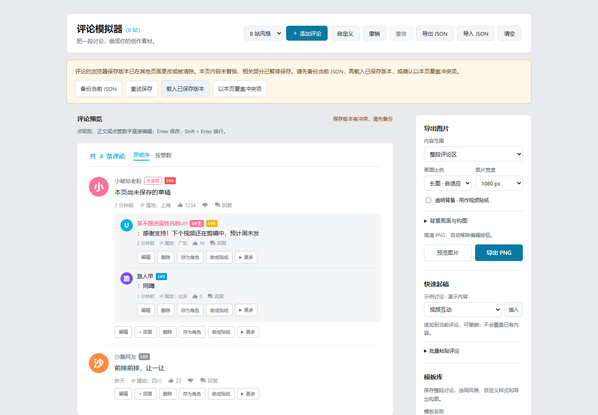

## 贡献指南

欢迎贡献！这是一个简单的单文件项目：

1. Fork 本仓库
2. 创建你的分支 (`git checkout -b feature/xxx`)
3. 修改 `index.html`
4. 提交并推送 (`git commit -m '添加某功能' && git push`)
5. 创建 Pull Request

主要改进方向：
- 补充新的内容模板与导出场景
- 更新 html2canvas 版本（替换 `vendor-html2canvas` 脚本块内的上游发行文件，保留完整 MIT 许可和版权头，核对文件散列并验证 PNG 输出；不要直接修改压缩库内部代码）
- 添加更多平台主题样式
- 优化代码结构

## 已知限制

- **纯本地、无后端、无账号**：数据只存在当前浏览器的 localStorage，换浏览器/设备/无痕模式都不互通，也无法多人协作。
- **离线素材范围**：本地 HTML、字母头像和上传的图片可离线出图。外站图片网址仍受网络和 CORS 限制；在线网址断网刷新不保证可用，请下载完整 HTML 使用。
- **外站头像截图受 CORS 限制**：引用其他网站的图片 URL 时，可能缺失或被替换成字母头像，建议改用随机字母头像或本地上传。
- **localStorage 容量有限**：自动缩小图片也不能保证所有素材都能存入。保存失败时内容仅本页保留，请导出JSON；浏览器禁用存储时亦如此。
- **长图上限**：导出限制高度 16000 px、总像素 2400 万；超出时请减少评论或降低宽度。
- **未验证的在线演示地址**：是否启用 GitHub Pages 取决于仓库设置，本仓库不保证 `github.io` 演示链接长期可用。

## 许可证

[MIT](LICENSE)。内置 html2canvas 1.4.1 保留原作者 Niklas von Hertzen 的版权及完整 MIT 许可，随 `index.html` 一起分发；[上游许可证](https://github.com/niklasvh/html2canvas/blob/v1.4.1/LICENSE)。
